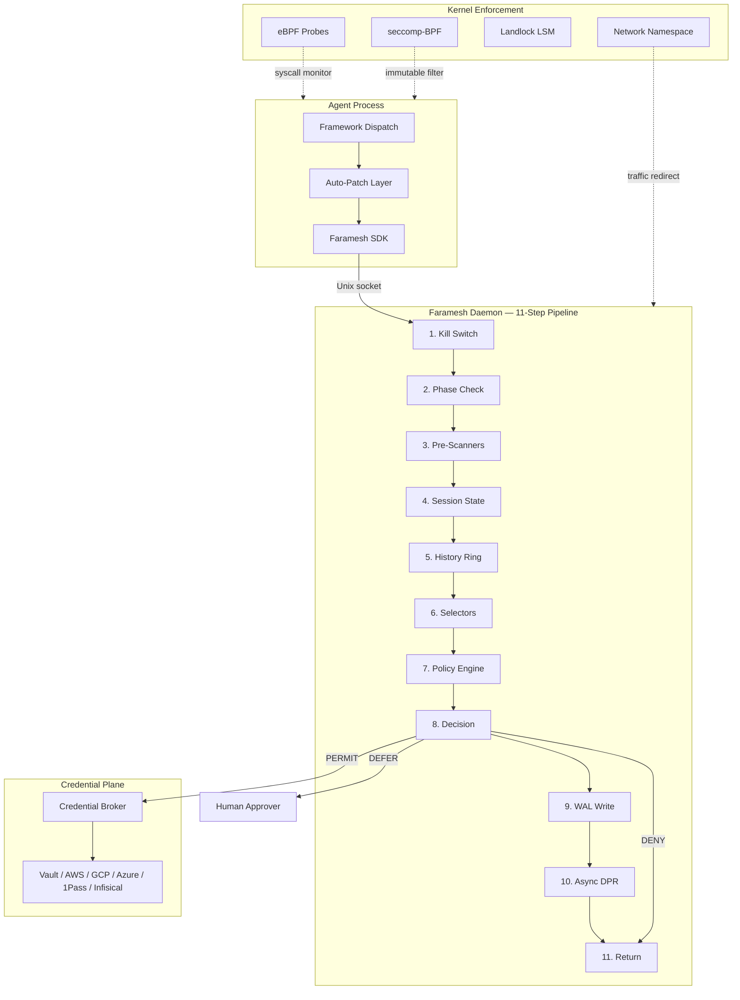

<h1 align="center">Faramesh</h1>

<p align="center">
  <a href="LICENSE"></a>
</p>

<p align="center">
  <strong>Pre-execution governance engine for AI agents. One binary. One command. Every framework.</strong>
</p>

---

## Quick Install

```bash
# Homebrew (macOS / Linux)
brew install faramesh/tap/faramesh

# Direct binary
curl -fsSL https://get.faramesh.dev | sh

# Go toolchain
go install github.com/faramesh/faramesh-core/cmd/faramesh@latest

# Python SDK
pip install faramesh

# Node.js SDK
npm install @faramesh/sdk
```

## 30-Second Demo

```bash
faramesh demo
```

```
Faramesh — Unified Agent Governance

[10:00:15] PERMIT  get_exchange_rate      from=USD to=SEK              latency=11ms
[10:00:17] DENY    shell/run              cmd="rm -rf /"               scanner=SCANNER_DENY
[10:00:18] PERMIT  read_customer          id=cust_abc123               latency=9ms
[10:00:20] DEFER   stripe/refund          amount=$12,000               awaiting approval
[10:00:21] DENY    send_email             recipients=847               policy=deny-mass-email

5 actions evaluated. 2 PERMIT  2 DENY  1 DEFER
```

## How It Works

1. Write a policy in FPL (or natural language — Faramesh compiles it for you).
2. Wrap your agent with `faramesh run`.
3. Faramesh auto-detects the framework, patches tool dispatch, strips ambient credentials, and routes every call through the governance pipeline.
4. Every action is evaluated, logged to a tamper-evident chain, and returned in microseconds.

```bash
faramesh run python agent.py
```

```
Faramesh Enforcement Report
  Runtime:     local
  Framework:   langchain

  ✓ Framework auto-patch (FARAMESH_AUTOLOAD)
  ✓ Credential broker (stripped: OPENAI_API_KEY, STRIPE_API_KEY)
  ✓ Network interception (proxy env vars)

  Trust level: PARTIAL
```

## FPL — Faramesh Policy Language

FPL is the native policy format for Faramesh. It is a structured, human-readable language that covers agent identity, budget, phased workflows, rules, delegation, ambient credential stripping, selectors, and credential binding — all in one file.

```fpl
agent "payment-bot" {
  budget { max_calls = 500; max_cost_usd = 50.00; window = "1h" }

  phase "research" {
    allow = ["web_search", "read_document"]
  }
  phase "execute" {
    allow = ["stripe/*", "send_email"]
  }

  rule block-destructive-shell {
    match  { tool = "shell/run"; when = 'args["cmd"] matches "rm\\s+-[rf]"' }
    effect = deny
  }
  rule require-approval-high-refund {
    match  { tool = "stripe/refund"; when = 'args["amount"] > 500' }
    effect = defer
    reason = "refund exceeds $500 — requires finance approval"
  }

  delegate "finance-team" {
    tools  = ["stripe/refund"]
    when   = 'args["amount"] > 500'
    quorum = 1
    ttl    = "4h"
  }

  ambient {
    strip = ["OPENAI_API_KEY", "STRIPE_API_KEY", "AWS_SECRET_ACCESS_KEY"]
  }

  selector "fraud-score" {
    source = "https://risk.internal/api/score"
    cache  = "30s"
    bind   = "ctx.fraud_score"
  }

  credential "stripe" {
    backend = "vault"
    path    = "secret/data/stripe/live"
    field   = "api_key"
    ttl     = "15m"
  }
}
```

You can also write policy in plain English and compile it:

```bash
faramesh policy compile "deny all shell commands, defer refunds over $500 to finance"
```

Faramesh's NLP compiler parses the sentence, matches intent to FPL constructs, and emits a valid policy file.

## Supported Frameworks

All 13 frameworks are auto-patched at runtime — zero code changes required.

| Framework | Patch Point |
|-----------|-------------|
| LangGraph / LangChain | `BaseTool.run()` |
| CrewAI | `BaseTool._run()` |
| AutoGen / AG2 | `ConversableAgent._execute_tool_call()` |
| Pydantic AI | `Tool.run()` + `Agent._call_tool()` |
| Google ADK | `FunctionTool.call()` |
| LlamaIndex | `FunctionTool.call()` / `BaseTool.call()` |
| AWS Strands Agents | `Agent._run_tool()` |
| OpenAI Agents SDK | `FunctionTool.on_invoke_tool()` |
| Smolagents | `Tool.__call__()` |
| Haystack | `Pipeline.run()` |
| Deep Agents | LangGraph dispatch + `AgentMiddleware` |
| AWS Bedrock AgentCore | App middleware + Strands hook |
| MCP Servers (Node.js) | `tools/call` handler |

## Governing Real Runtimes

### OpenClaw

Govern an OpenClaw gateway with full credential isolation:

```bash
faramesh run node openclaw/gateway.js
```

Faramesh detects the OpenClaw runtime, patches the Node.js tool dispatch, and replaces any credentials found in `~/.openclaw/` with broker-managed references. The agent never sees raw API keys — credentials are injected only when policy permits the specific tool call.

### NemoClaw

NemoClaw defines workflows in YAML. Faramesh runs alongside it inside a sandboxed namespace:

```yaml
# nemoclaw-workflow.yaml
agents:
  - name: research-agent
    tools: [web_search, summarize]
```

```bash
faramesh serve --policy policy.fpl &
nemoclaw run nemoclaw-workflow.yaml
```

NemoClaw's tool calls are routed through Faramesh's proxy. Both systems coexist — NemoClaw handles orchestration, Faramesh handles governance. The sandbox ensures NemoClaw cannot bypass the proxy.

### Deep Agents

Deep Agents uses LangGraph internally. Faramesh patches it at the dispatch level and adds middleware integration:

```bash
faramesh run deepagents-cli start
```

The `AgentMiddleware` layer intercepts every tool call from Deep Agents' multi-agent graph, evaluates it against policy, and enforces budget and phase constraints across all sub-agents in the swarm.

### Claude Code

Govern Claude Code's agent with policy enforcement across all tool calls:

```bash
faramesh run claude
```

Claude Code's tool calls (file edits, shell commands, web searches) flow through the governance pipeline. For agent teams, each sub-agent inherits the policy but maintains its own session budget and kill switch. A single `faramesh agent kill claude` stops all sub-agents immediately.

### Cursor

Govern Cursor's background agent with the same enforcement stack:

```bash
faramesh run cursor
```

Cursor's background agent tool calls (file writes, terminal commands, code generation) are intercepted by Faramesh. Policy rules apply to every action — block destructive shell commands, require approval for large refactors, enforce file-path allow-lists. The agent runs inside the governance sandbox with full audit logging.

## Credential Broker

Faramesh strips API keys from the agent's environment. The agent requests credentials through the broker at call time — if policy denies the action, the credential is never issued.

| Backend | Config |
|---------|--------|
| HashiCorp Vault | `--vault-addr`, `--vault-token` |
| AWS Secrets Manager | `--aws-secrets-region` |
| GCP Secret Manager | `--gcp-secrets-project` |
| Azure Key Vault | `--azure-vault-url`, `--azure-tenant-id` |
| 1Password Connect | `FARAMESH_CREDENTIAL_1PASSWORD_HOST` |
| Infisical | `FARAMESH_CREDENTIAL_INFISICAL_HOST` |

## Cross-Platform Enforcement

| Platform | Layers | Trust Level |
|----------|--------|-------------|
| **Linux + root** | seccomp-BPF + Landlock + netns + iptables + credential broker + auto-patch | STRONG |
| **Linux** | Landlock + proxy env vars + credential broker + auto-patch | MODERATE |
| **macOS** | Proxy env vars + PF rules (sudo) + credential broker + auto-patch | PARTIAL |
| **Windows** | Proxy env vars + WinDivert (admin) + credential broker + auto-patch | PARTIAL |
| **Serverless** | Credential broker + auto-patch | CREDENTIAL_ONLY |

`faramesh run` detects the OS and activates the strongest available enforcement automatically.

## CLI Reference

### Installation & Bootstrap

| Command | Description |
|---------|-------------|
| `faramesh demo` | Run the interactive governance demo |
| `faramesh init` | Auto-detect environment, generate config and starter policy |
| `faramesh detect` | Print runtime, framework, and harness detection results |
| `faramesh status` | Show daemon status, active sessions, enforcement level |
| `faramesh stop` | Stop the governance daemon |

### Daemon

| Command | Description |
|---------|-------------|
| `faramesh serve` | Start the governance daemon |

**Flags:** `--policy <path>`, `--listen <addr>`, `--socket <path>`, `--db <path>`, `--tls-cert <path>`, `--tls-key <path>`, `--log-level <level>`, `--metrics-addr <addr>`, `--vault-addr <addr>`, `--vault-token <token>`, `--aws-secrets-region <region>`, `--gcp-secrets-project <project>`, `--azure-vault-url <url>`, `--azure-tenant-id <id>`

### Execution

| Command | Description |
|---------|-------------|
| `faramesh run <command>` | Govern an agent with the full enforcement stack |
| `faramesh explain <action>` | Show which rules would match a given action |
| `faramesh simulate <action>` | Dry-run an action against loaded policy |

**`run` flags:** `--policy <path>`, `--agent-id <id>`, `--phase <name>`, `--budget <n>`, `--budget-usd <amount>`, `--timeout <duration>`, `--sandbox`, `--no-sandbox`, `--credential-broker`, `--env <KEY=VAL>`, `--strip-env <KEY>`, `--log-level <level>`, `--socket <path>`

### Policy

| Command | Description |
|---------|-------------|
| `faramesh policy validate <path>` | Validate and compile a policy file |
| `faramesh policy inspect <path>` | Show compiled policy summary |
| `faramesh policy diff <a> <b>` | Diff two policy files |
| `faramesh policy backtest <path>` | Replay policy against historical WAL |
| `faramesh policy compile <text>` | Compile natural language to FPL |
| `faramesh policy fpl <path>` | Parse and display an FPL policy |
| `faramesh policy activate <path>` | Hot-reload a new policy into the running daemon |
| `faramesh policy rollback` | Roll back to the previous active policy |
| `faramesh policy history` | Show policy activation history |
| `faramesh policy insights` | Show policy analytics — hit rates, latency, coverage |
| `faramesh policy debug <action>` | Trace policy evaluation for a specific action |
| `faramesh policy cover <path>` | Show coverage report — which rules matched |
| `faramesh policy suite <path>` | Run a policy test suite |
| `faramesh policy reload` | Reload policy from disk without restart |

### Session

| Command | Description |
|---------|-------------|
| `faramesh session open` | Open a new governance session |
| `faramesh session close <id>` | Close a session |
| `faramesh session list` | List active sessions |
| `faramesh session budget <id>` | Show session budget usage |
| `faramesh session reset <id>` | Reset session counters |
| `faramesh session inspect <id>` | Show detailed session state |
| `faramesh session purpose <id> <text>` | Set the declared purpose for a session |

### Agent

| Command | Description |
|---------|-------------|
| `faramesh agent approve <token>` | Approve a deferred action |
| `faramesh agent deny <token>` | Deny a deferred action |
| `faramesh agent kill <agent-id>` | Activate kill switch for an agent |
| `faramesh agent unkill <agent-id>` | Deactivate kill switch |
| `faramesh agent killed` | List agents with active kill switches |
| `faramesh agent pending` | List actions awaiting approval |
| `faramesh agent list` | List known agents |
| `faramesh agent inspect <agent-id>` | Show agent details and session history |
| `faramesh agent history <agent-id>` | Show agent action history |

### Audit

| Command | Description |
|---------|-------------|
| `faramesh audit tail` | Stream live decisions |
| `faramesh audit verify <db>` | Verify DPR chain integrity |
| `faramesh audit export <path>` | Export audit log |
| `faramesh audit stats` | Show decision statistics |
| `faramesh audit query <filter>` | Query audit records with filters |
| `faramesh audit incidents` | List incidents from audit records |
| `faramesh audit label <id> <label>` | Label an audit record |
| `faramesh audit trace <id>` | Show full trace for a decision |
| `faramesh audit drift` | Detect policy drift from audit history |
| `faramesh audit ambient` | Show ambient credential exposure events |

### Credential

| Command | Description |
|---------|-------------|
| `faramesh credential register <name>` | Register a credential with the broker |
| `faramesh credential list` | List registered credentials |
| `faramesh credential inspect <name>` | Show credential details |
| `faramesh credential rotate <name>` | Rotate a credential |
| `faramesh credential health` | Check credential backend connectivity |
| `faramesh credential revoke <name>` | Revoke a credential |
| `faramesh credential audit` | Show credential access log |

### Delegation

| Command | Description |
|---------|-------------|
| `faramesh delegation grant <spec>` | Grant delegation authority |
| `faramesh delegation list` | List active delegations |
| `faramesh delegation revoke <id>` | Revoke a delegation |
| `faramesh delegation inspect <id>` | Show delegation details |
| `faramesh delegation verify <id>` | Verify delegation chain validity |
| `faramesh delegation chain <id>` | Show full delegation chain |

### Identity

| Command | Description |
|---------|-------------|
| `faramesh identity verify <id>` | Verify an agent identity |
| `faramesh identity trust <id>` | Add an identity to the trust store |
| `faramesh identity whoami` | Show current identity |
| `faramesh identity attest <id>` | Create an attestation for an identity |
| `faramesh identity federation` | Show federation membership |
| `faramesh identity trust-level <id>` | Show computed trust level for an identity |

### Incident

| Command | Description |
|---------|-------------|
| `faramesh incident declare <desc>` | Declare a governance incident |
| `faramesh incident list` | List incidents |
| `faramesh incident inspect <id>` | Show incident details |
| `faramesh incident isolate <agent-id>` | Isolate an agent during an incident |
| `faramesh incident evidence <id>` | Collect evidence bundle for an incident |
| `faramesh incident resolve <id>` | Resolve an incident |
| `faramesh incident playbook <id>` | Show the response playbook for an incident |

### Schedule

| Command | Description |
|---------|-------------|
| `faramesh schedule create <spec>` | Create a scheduled governance action |
| `faramesh schedule list` | List scheduled actions |
| `faramesh schedule inspect <id>` | Show schedule details |
| `faramesh schedule cancel <id>` | Cancel a scheduled action |
| `faramesh schedule approve <id>` | Approve a pending scheduled action |
| `faramesh schedule pending` | List schedules awaiting approval |
| `faramesh schedule history` | Show schedule execution history |

### Provenance

| Command | Description |
|---------|-------------|
| `faramesh provenance sign <artifact>` | Sign an artifact |
| `faramesh provenance verify <artifact>` | Verify an artifact signature |
| `faramesh provenance inspect <artifact>` | Show provenance metadata |
| `faramesh provenance diff <a> <b>` | Diff two artifact provenance records |
| `faramesh provenance list` | List signed artifacts |

### Model

| Command | Description |
|---------|-------------|
| `faramesh model register <spec>` | Register a model with governance metadata |
| `faramesh model verify <id>` | Verify model integrity and provenance |
| `faramesh model consistency <id>` | Check model consistency across deployments |
| `faramesh model list` | List registered models |
| `faramesh model alert <id>` | Show alerts for a model |

### Ops

| Command | Description |
|---------|-------------|
| `faramesh ops policy-change propose <path>` | Propose a policy change |
| `faramesh ops policy-change list` | List pending policy changes |
| `faramesh ops policy-change approve <id>` | Approve a policy change |
| `faramesh ops policy-change reject <id>` | Reject a policy change |
| `faramesh ops audit` | Show ops audit log |
| `faramesh ops login` | Authenticate to the governance control plane |
| `faramesh ops logout` | Log out |
| `faramesh ops whoami` | Show authenticated identity |

### Fleet

| Command | Description |
|---------|-------------|
| `faramesh fleet list` | List fleet members |
| `faramesh fleet status` | Show fleet-wide status |
| `faramesh fleet push <policy>` | Push a policy to all fleet members |
| `faramesh fleet kill <agent-id>` | Kill an agent across the fleet |

### Hub

| Command | Description |
|---------|-------------|
| `faramesh hub search <query>` | Search the policy hub |
| `faramesh hub install <name>` | Install a policy from the hub |
| `faramesh hub publish <path>` | Publish a policy to the hub |
| `faramesh hub verify <name>` | Verify a hub policy signature |

### Federation

| Command | Description |
|---------|-------------|
| `faramesh federation trust add <org>` | Add a trusted federation peer |
| `faramesh federation trust list` | List federation trust relationships |
| `faramesh federation trust revoke <org>` | Revoke federation trust |
| `faramesh federation receipt verify <id>` | Verify a cross-org governance receipt |
| `faramesh federation receipt issue <spec>` | Issue a governance receipt |

### Chaos

| Command | Description |
|---------|-------------|
| `faramesh chaos degraded` | Simulate degraded enforcement |
| `faramesh chaos fault <type>` | Inject a fault into the governance pipeline |
| `faramesh chaos run --scenario <name>` | Run a chaos scenario |
| `faramesh chaos list-scenarios` | List available chaos scenarios |

### Compensation

| Command | Description |
|---------|-------------|
| `faramesh compensation list` | List compensation records |
| `faramesh compensation inspect <id>` | Show compensation details |
| `faramesh compensation apply <id>` | Apply a compensation action |
| `faramesh compensation status <id>` | Show compensation status |
| `faramesh compensation retry <id>` | Retry a failed compensation |

### Compliance

| Command | Description |
|---------|-------------|
| `faramesh compliance export` | Export a compliance evidence bundle |

### Supply Chain

| Command | Description |
|---------|-------------|
| `faramesh supply-chain sign <artifact>` | Sign a supply chain artifact |
| `faramesh supply-chain verify <artifact>` | Verify a supply chain signature |
| `faramesh supply-chain sbom <path>` | Generate a software bill of materials |

### MCP

| Command | Description |
|---------|-------------|
| `faramesh mcp wrap <server>` | Wrap an MCP server with governance |

## Architecture

Every tool call flows through the same 11-step pipeline regardless of framework or adapter. The nine-layer enforcement stack spans from kernel-level syscall filters to in-process SDK hooks.



If step 9 (WAL write) fails, the decision is DENY. No execution without a durable audit record.

## License

[MIT](LICENSE)
