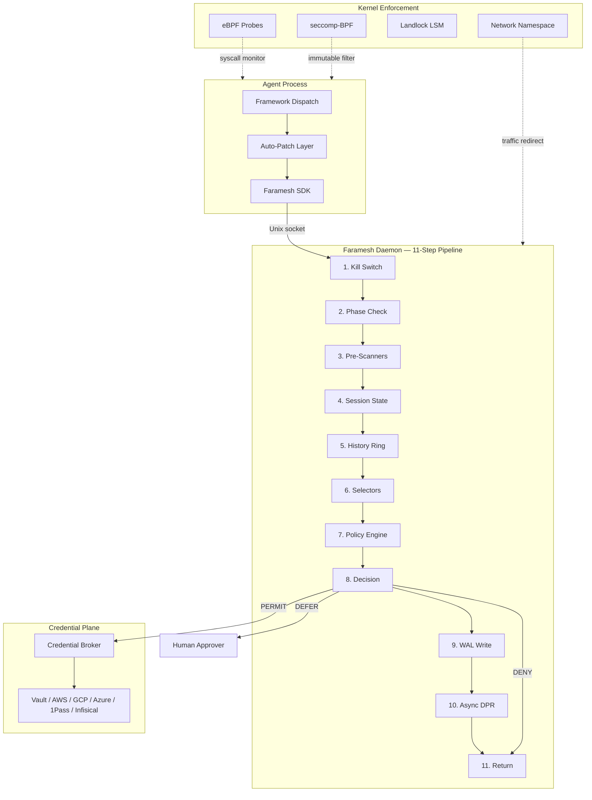

<p align="center">
  
</p>

<p align="center">
  <strong>Pre-execution governance engine for AI agents.</strong><br />
  One binary. One command. Every framework.
</p>

<p align="center">
  <a href="LICENSE"></a>
  <a href="https://github.com/faramesh/faramesh-core/actions/workflows/ci.yml"></a>
  <a href="https://github.com/faramesh/faramesh-core/releases"></a>
  <a href="https://goreportcard.com/report/github.com/faramesh/faramesh-core"></a>
</p>

---

## What is Faramesh?

Faramesh sits between your AI agent and the tools it calls. Every tool call is checked against your policy before it runs. If the policy says no, the action is blocked. If the policy says wait, a human decides. Every decision is logged to a tamper-evident chain.

Most "AI governance" tools add a second AI to watch the first. That's probability watching probability. Faramesh uses deterministic rules — code that evaluates the same way every time. No model in the middle. No guessing.

## Install

```bash
# curl (fastest)
curl -fsSL https://raw.githubusercontent.com/faramesh/faramesh-core/main/install.sh | bash

# Homebrew
brew install faramesh/tap/faramesh

# npm package
npx @faramesh/cli@latest init

# Go toolchain
go install github.com/faramesh/faramesh-core/cmd/faramesh@latest
```

## Quick Start

```bash
# Govern your agent — one command
faramesh run python agent.py
```

```
Faramesh Enforcement Report
  Runtime:     local
  Framework:   langchain

  ✓ Framework auto-patch (FARAMESH_AUTOLOAD)
  ✓ Credential broker (stripped: OPENAI_API_KEY, STRIPE_API_KEY)
  ✓ Network interception (proxy env vars)

  Trust level: PARTIAL
```

Watch live decisions:

```bash
faramesh audit tail
```

```
[10:00:15] PERMIT  get_exchange_rate      from=USD to=SEK              latency=11ms
[10:00:17] DENY    shell/run              cmd="rm -rf /"               policy=deny!
[10:00:18] PERMIT  read_customer          id=cust_abc123               latency=9ms
[10:00:20] DEFER   stripe/refund          amount=$12,000               awaiting approval
[10:00:21] DENY    send_email             recipients=847               policy=deny-mass-email
```

## FPL — Faramesh Policy Language

**FPL is the standard policy language for Faramesh.** Every policy starts as FPL. It is a domain-specific language purpose-built for AI agent governance — shorter than YAML, safer than Rego, readable by anyone.

```fpl
agent payment-bot {
  default deny
  model "gpt-4o"
  framework "langgraph"

  budget session {
    max $500
    daily $2000
    max_calls 100
    on_exceed deny
  }

  phase intake {
    permit read_customer
    permit get_order
  }

  rules {
    deny! shell/* reason: "never shell"
    defer stripe/refund when amount > 500
      notify: "finance"
      reason: "high value refund"
    permit stripe/* when amount <= 500
  }

  credential stripe {
    backend vault
    path secret/data/stripe/live
    ttl 15m
  }
}
```

### Why FPL?

| | FPL | YAML + expr | OPA / Rego | Cedar |
|---|---|---|---|---|
| Agent-native primitives | Yes — sessions, budgets, phases, delegation, ambient | Convention-based | No | No |
| Mandatory deny (`deny!`) | Compile-time enforced | Documentation convention | Runtime only | Runtime only |
| Lines for above policy | 25 | 65+ | 80+ | 50+ |
| Natural language compilation | Yes | No | No | No |
| Backtest before activation | Built-in | Manual | Manual | No |

### Multiple input modes, one engine

FPL is the canonical format. You can also write policies as:

- **Natural language** — `faramesh policy compile "deny all shell commands, defer refunds over $500 to finance"` compiles to FPL, validates it, and backtests it against real history before activation.
- **YAML** — always supported as an interchange format. `faramesh policy compile policy.yaml --to fpl` converts to FPL. Both formats compile to the same internal representation.
- **Code annotations** — `@faramesh.tool(defer_above=500)` in your source code is extracted to FPL automatically.

### `deny!` — mandatory deny

`deny!` is a compile-time constraint. It cannot be overridden by position, by a child policy in an `extends` chain, by priority, or by any subsequent `permit` rule. OPA, Cedar, and YAML-based engines express this as a documentation convention. FPL enforces it structurally.

## Supported Frameworks

All 13 frameworks are auto-patched at runtime — zero code changes required.

| Framework | Patch Point |
|-----------|-------------|
| LangGraph / LangChain | `BaseTool.run()` |
| CrewAI | `BaseTool._run()` |
| AutoGen / AG2 | `ConversableAgent._execute_tool_call()` |
| Pydantic AI | `Tool.run()` + `Agent._call_tool()` |
| Google ADK | `FunctionTool.call()` |
| LlamaIndex | `FunctionTool.call()` / `BaseTool.call()` |
| AWS Strands Agents | `Agent._run_tool()` |
| OpenAI Agents SDK | `FunctionTool.on_invoke_tool()` |
| Smolagents | `Tool.__call__()` |
| Haystack | `Pipeline.run()` |
| Deep Agents | LangGraph dispatch + `AgentMiddleware` |
| AWS Bedrock AgentCore | App middleware + Strands hook |
| MCP Servers (Node.js) | `tools/call` handler |

## Governing Real Runtimes

### OpenClaw

```bash
faramesh run -- node openclaw/gateway.js
```

Faramesh patches the OpenClaw tool dispatch, strips credentials from `~/.openclaw/`, and governs every tool call through the policy engine. The agent never sees raw API keys.

### NemoClaw

```bash
faramesh run --enforce full -- python -m nemoclaw.serve --config agent.yaml
```

NemoClaw runs inside Faramesh's sandbox. On Linux, the kernel sandbox (seccomp-BPF, Landlock, network namespace) prevents the agent from bypassing governance.

### Deep Agents (LangChain)

```bash
faramesh run -- python -m deep_agents.main
```

Faramesh patches `BaseTool.run()` and injects `AgentMiddleware` into the LangGraph execution loop. Multi-agent delegation is tracked with cryptographic tokens — the supervisor's permissions are the ceiling for any sub-agent.

### Claude Code / Cursor

```bash
faramesh mcp wrap -- node your-mcp-server.js
```

Faramesh intercepts every MCP `tools/call` request. The IDE agent connects to Faramesh instead of the real MCP server. Non-tool-call methods pass through unchanged.

## Credential Broker

Faramesh strips API keys from the agent's environment. Credentials are only issued after the policy permits the specific tool call.

| Backend | Config |
|---------|--------|
| HashiCorp Vault | `--vault-addr`, `--vault-token` |
| AWS Secrets Manager | `--aws-secrets-region` |
| GCP Secret Manager | `--gcp-secrets-project` |
| Azure Key Vault | `--azure-vault-url`, `--azure-tenant-id` |
| 1Password Connect | `FARAMESH_CREDENTIAL_1PASSWORD_HOST` |
| Infisical | `FARAMESH_CREDENTIAL_INFISICAL_HOST` |

## Cross-Platform Enforcement

| Platform | Layers | Trust Level |
|----------|--------|-------------|
| **Linux + root** | seccomp-BPF + Landlock + netns + eBPF + credential broker + auto-patch | STRONG |
| **Linux** | Landlock + proxy + credential broker + auto-patch | MODERATE |
| **macOS** | Proxy env vars + PF rules + credential broker + auto-patch | PARTIAL |
| **Windows** | Proxy env vars + WinDivert + credential broker + auto-patch | PARTIAL |
| **Serverless** | Credential broker + auto-patch | CREDENTIAL_ONLY |

## Policy Packs

Ready-to-use FPL policies in `examples/`:

| File | Description |
|------|-------------|
| [`starter.fpl`](examples/starter.fpl) | General-purpose starter policy — blocks destructive commands, defers large payments |
| [`payment-bot.fpl`](examples/payment-bot.fpl) | Financial agent with session budgets, phased workflow, and credential brokering |
| [`infra-bot.fpl`](examples/infra-bot.fpl) | Infrastructure agent with strict sandbox, Terraform governance, and duty delegation |
| [`customer-support.fpl`](examples/customer-support.fpl) | Support agent with intake/resolve phases, credit limits, and mass-email protection |
| [`mcp-server.fpl`](examples/mcp-server.fpl) | MCP server wrapper policy for IDE agents (Claude Code, Cursor) |

## CLI Reference

See the [full CLI reference](https://faramesh.dev/docs/cli-reference) for all 130+ commands. Key commands:

| Command | What it does |
|---------|-------------|
| `faramesh run <cmd>` | Govern an agent with the full enforcement stack |
| `faramesh policy validate <path>` | Validate an FPL or YAML policy |
| `faramesh policy compile <text>` | Compile natural language to FPL |
| `faramesh audit tail` | Stream live decisions |
| `faramesh audit verify` | Verify DPR chain integrity |
| `faramesh agent approve <token>` | Approve a deferred action |
| `faramesh agent kill <id>` | Emergency kill switch |
| `faramesh credential register <name>` | Register a credential with the broker |
| `faramesh session open` | Open a governance session |
| `faramesh incident declare <desc>` | Declare a governance incident |
| `faramesh mcp wrap <server>` | Wrap an MCP server with governance |

## Architecture



If the WAL write fails, the decision is DENY. No execution without a durable audit record.

## SDKs

| Language | Path | Package |
|----------|------|---------|
| Python | [`sdk/python`](sdk/python) | `pip install faramesh` |
| TypeScript / Node.js | [`sdk/node`](sdk/node) | `npm install faramesh` |

Both SDKs provide `govern()`, `GovernedTool`, policy helpers, snapshot canonicalization, and `gate()` for wrapping any tool call with pre-execution governance.

## Documentation

Full documentation at [faramesh.dev/docs](https://faramesh.dev/docs).

## Contributing

See [CONTRIBUTING.md](CONTRIBUTING.md) for development setup, coding standards, and contribution workflow.

## License

[MIT](LICENSE)
